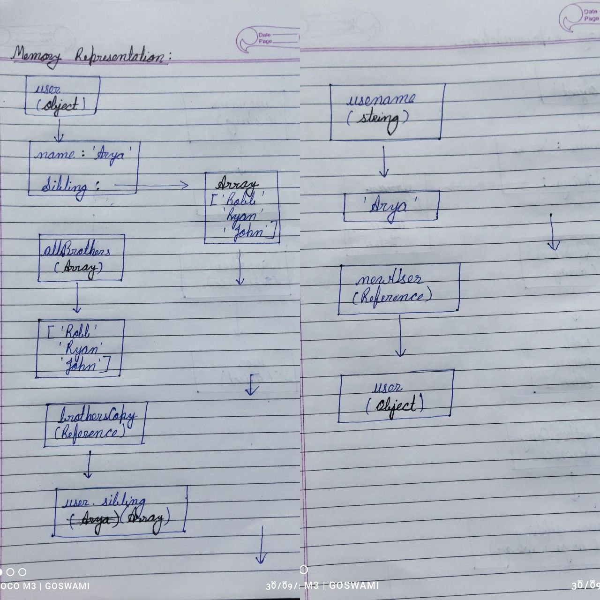

```js
let user = {
  name: 'Arya',
  sibling: ['Robb', 'Ryan', 'John'],
};
let allBrothers = ['Robb', 'Ryan', 'John'];
let brothersCopy = user.sibling;
let usename = user.name;
let newUser = user;
```

1. Memory representation

- Create the memory representation of the above snippet on notebook.
- Take a photo/screenshot and add it to the folder `code`

<!-- To add this image here use  -->



2. Answer the following with reason:

- `user == newUser;` // `true`, Both `user` and `newUser` are objects, and they reference the same memory location.
- `user === newUser;` // `true`,   Same as above. Both `user` and `newUser` are objects, and they reference the same memory location.
- `user.name === newUser.name;` // `true`,  Both `user.name` and `newUser.name` are strings with the same value (`'Arya'`).
- `user.name == newUser.name;`// `true`, Same as above. Both `user.name`and `newUser.name` are strings with the same value (`'Arya'`).
- `user.sibling == newUser.sibling;`// `true`,   Both `user.sibling` and `newUser.sibling` are arrays, and they reference the same memory location.
- `user.sibling === newUser.sibling;`// `true`, Same as above. Both `user.sibling` and `newUser.sibling` are arrays, and they reference the same memory location.
- `user.sibling == allBrothers;` //`false`, Although both `user.sibling` and `allBrothers` are arrays with the same elements, they are not the same array object. In JavaScript, arrays are compared by reference, not by value.
- `user.sibling === allBrothers;` //`false`, same as above.
- `brothersCopy === allBrothers;` //`false`,  Although `brothersCopy` is a copy of `user.sibling`, it is not the same array object as `allBrothers`.
- `brothersCopy == allBrothers;` //`false`, same as above.
- `brothersCopy == user.sibling;` // `true`, Although `brothersCopy` is a separate array object from `user.sibling`, they have the same elements. However, this is a coincidence, and the comparison is still done by reference. If the arrays had different elements, the comparison would be `false`.
- `brothersCopy === user.sibling;` // `false`,  `brothersCopy` and `user.sibling` are separate array objects, even though they have the same elements.
- `brothersCopy[0] === user.sibling[0];` // `true`, Both `brothersCopy[0]` and `user.sibling[0]` are strings with the same value (`'Robb'`).
- `brothersCopy[1] === user.sibling[1];` // `true`,  Both `brothersCopy[1]` and `user.sibling[1]` are strings with the same value (`'Ryan'`). 
- `user.sibling[1] === newUser.sibling[1];` //`true`, Both `user.sibling[1]` and `newUser.sibling[1]` are strings with the same value (`'Ryan'`).
